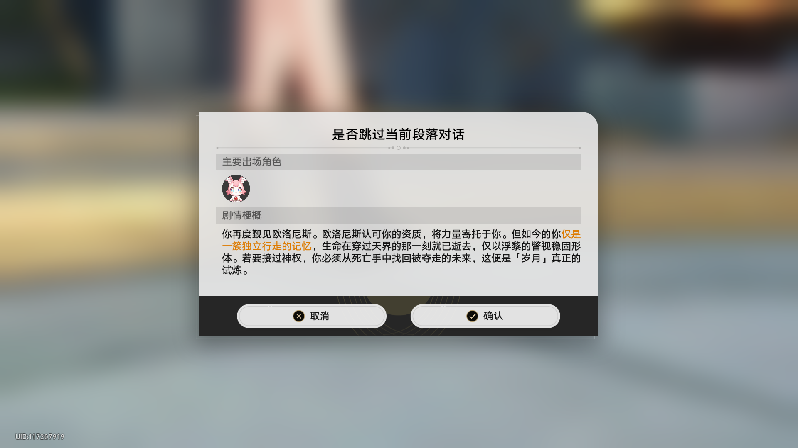
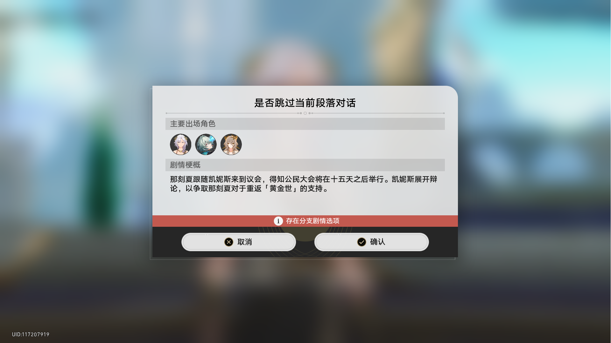
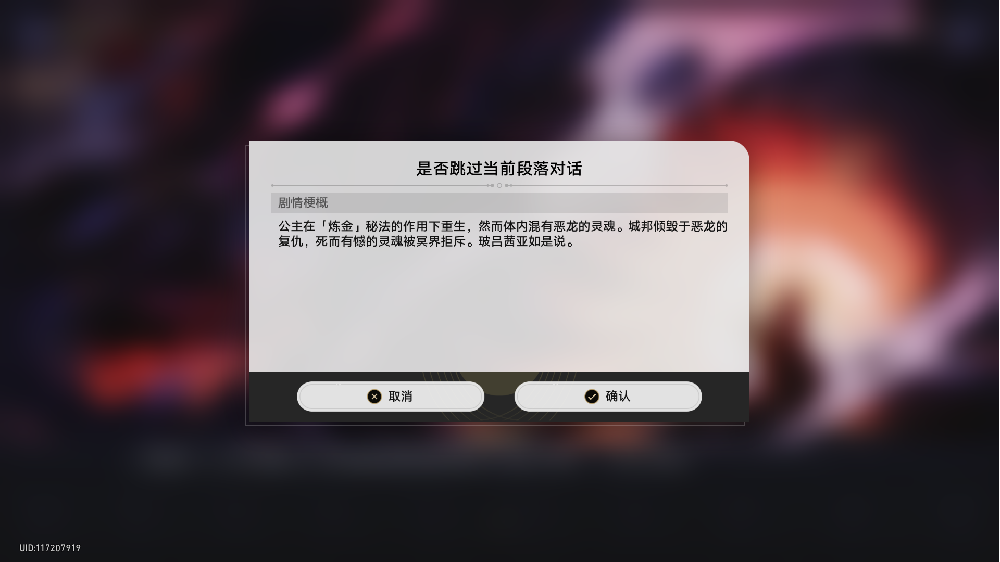
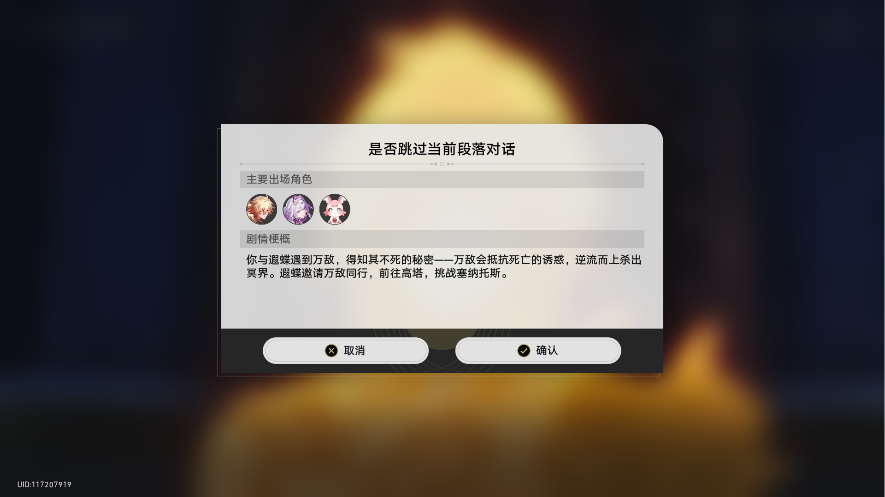

# 崩坏星穹铁道剧情梗概提取器

## 项目简介
这是一个基于百度OCR API的工具，用于从崩坏星穹铁道游戏截图中提取剧情梗概文本。工具会自动识别图片中的文本，提取从"剧情梗概"开始到遇到特定停止标记（如"存在分支剧情选项"、"取消"等）的内容。

## 功能特点
- 自动识别游戏截图中的文本
- 智能提取剧情梗概内容
- 支持自定义开始和停止标记
- 可输出OCR调试信息以便优化识别效果
- 支持字体增强以提高识别准确率
- 多语言支持：所有提示文本均可通过语言文件自定义，方便国际化

## 安装依赖
1. 确保已安装Python 3.6或更高版本
2. 安装必要的Python库：
   ```bash
   pip install Pillow chardet baidu-aip
   ```
3. （可选）安装游戏字体以提高识别准确率，注意目前只接受“zh-cn.ttf”，“zh-tw.ttf”，“ja-jp.ttf”这三个字体文件名，分别对应崩坏星穹铁道本地游戏资源中的三种字体

## 使用方法
[基本完成] 未来将加入自动下载库的功能，只需下载主脚本并运行即可自动尝试补全其他文件，由于python的特性，无法一次启动就补全所有文件，需要手动运行一次脚本后，再手动运行一次脚本，即可自动运行处理。在处理上传图片的功能也模块化后，将正式更新这个使用方法，但现在确实也能这么用就是了
1. 克隆或下载本项目到本地
2. 在[百度AI开放平台](https://ai.baidu.com/)注册账号并创建OCR应用，获取APP_ID、API_KEY和SECRET_KEY
3. 复制`example/config.txt.example`文件到你想要处理图片的任意目录（例如`/path/to/project/example/`）下，并重命名为`config.txt`，然后填入你的百度OCR API密钥
4. 将游戏截图放入你选择的目录
5. 在该目录下运行脚本：
   ```bash
   python /path/to/project/example/process_images.py
   ```
   （请将`/path/to/project/example/`替换为你想要处理图片的目录）
6. 提取结果将保存到以当前目录名称命名的文本文件中（例如，若在`example`目录运行，则保存为`example.txt`）

## 多语言支持
本项目支持多语言显示，所有提示文本均从语言文件中加载，方便进行国际化适配。

### 语言文件结构
语言文件位于`lang`目录下，采用JSON格式，文件名格式为`{language-code}.json`（例如`zh-cn.json`表示简体中文）。

### 现有语言条目
目前支持的语言条目包括：
- 字体检测相关提示
- 配置文件相关提示
- 依赖库安装相关提示
- 错误信息提示

### 添加新语言
1. 在`lang`目录下创建新的语言文件，文件名格式为`{language-code}.json`
2. 复制`zh-cn.json`文件的内容到新文件中
3. 将所有文本值翻译为目标语言
4. 在代码中加载新的语言文件

### 自定义语言文本
你可以修改现有语言文件中的文本值，以满足特定需求。

## 示例展示
### 输入图片
项目支持批量处理游戏截图，以下是示例输入图片：

| 图片1 | 图片2 |
|-------|-------|
|  |  |
| 图片3 | 图片4 |
|-------|-------|
|  |  |

### 输出结果示例
处理完成后，提取的剧情梗概会保存到以当前目录名称命名的文本文件中（例如，若在`example`目录运行，则保存为`example.txt`），示例内容如下：

```
你再度觐见欧洛尼斯。欧洛尼斯认可你的资质，将力量寄托于你。但如今的你仅是一簇独立行走的记忆，生命在穿过天界的那一刻就已逝去，仅以浮黎的瞥视稳固形体。若要接过神权，你必须从死亡手中找回被夺走的未来，这便是「岁月」真正的试炼。
那刻夏跟随凯妮斯来到议会，得知公民大会将在十五天之后举行。凯妮斯展开辩论，以争取那刻夏对于重返「黄金世」的支持。
公主在「炼金」秘法的作用下重生，然而体内混有恶龙的灵魂。城邦倾毁于恶龙的复仇，死而有憾的灵魂被冥界拒斥。玻吕茜亚如是说。
你与遐蝶遇到万敌，得知其不死的秘密——万敌会抵抗死亡的诱惑，逆流而上杀出冥界。遐蝶邀请万敌同行，前往高塔，挑战塞纳托斯。

处理统计: 成功4张, 失败0张

提示：已检测到zh-cn.ttf字体文件，已启用简体中文识别增强。
```

### OCR调试信息
在配置文件中设置`OUTPUT_OCR_DEBUG=true`，可以生成详细的OCR调试信息到以当前目录名称命名的调试文件中（例如，若在`example`目录运行，则保存为`example_ocr_debug.txt`），包含每张图片的识别结果、字块详情和处理状态。示例如下：

```
=== OCR调试信息 ===
处理时间: 2025-08-16 22:28:26
处理图片总数: 4
成功处理: 4张
失败处理: 0张
使用字体增强: 是
字体路径: /path/to/project/zh-cn.ttf

=== 图片 1.png OCR识别结果 ===
识别模式: 高精度
识别类型: CHN_ENG
原始识别结果: {'paragraphs_result': [{'words_result_idx': [0]}, {'words_result_idx': [1]}, {'words_result_idx': [2]}, ...], 'words_result': [{'probability': {'average': 0.9999536276, 'min': 0.9998266101, 'variance': 2.465130322e-09}, 'words': '是否跳过当前段落对话'}, ...]}
字块详情:
  字块 1: 内容="是否跳过当前段落对话", 置信度=0.9999536276
  处理: 跳过
  字块 2: 内容="主要出场角色", 置信度=0.9998242259
  处理: 跳过
  字块 3: 内容="剧情梗概", 置信度=0.9988465905
  处理: 开始记录点
  字块 4: 内容="你再度觐见欧洛尼斯。欧洛尼斯认可你的资质，将力量寄托于你。但如今的你仅是", 置信度=0.9997444153
  处理: 保留
  字块 5: 内容="一簇独立行走的记忆，生命在穿过天界的那一刻就已逝去，仅以浮黎的瞥视稳固形", 置信度=0.9998212457
  处理: 保留
  字块 6: 内容="体。若要接过神权，你必须从死亡手中找回被夺走的未来，这便是「岁月」真正的", 置信度=0.9998027086
  处理: 保留
  字块 7: 内容="试炼。", 置信度=0.9994756579
  处理: 保留
  字块 8: 内容="×", 置信度=0.9808494449
  处理: 停止记录点
  字块 9: 内容="取消", 置信度=0.999748826
  处理: 跳过
  字块 10: 内容="确认", 置信度=0.9997832775
  处理: 跳过
  字块 11: 内容="UID:117207919", 置信度=0.99916327
  处理: 跳过

=== 图片 2.png OCR识别结果 ===
识别模式: 高精度
识别类型: CHN_ENG
原始识别结果: （略）
字块详情:
  字块 1: 内容="是否跳过当前段落对话", 置信度=0.9999477267
  处理: 跳过
  字块 2: 内容="主要出场角色", 置信度=0.9998199344
  处理: 跳过
  字块 3: 内容="剧情梗概", 置信度=0.9989771843
  处理: 开始记录点
  字块 4: 内容="那刻夏跟随凯妮斯来到议会，得知公民大会将在十五天之后举行。凯妮斯展开辩", 置信度=0.9998417497
  处理: 保留
  字块 5: 内容="论，以争取那刻夏对于重返「黄金世」的支持。", 置信度=0.9998950958
  处理: 保留
  字块 6: 内容="i", 置信度=0.9657149911
  处理: 停止记录点

[后续及图片3.png和4.png的OCR识别结果省略]
```

## 代码结构
本项目采用模块化设计，代码结构清晰，便于维护和扩展。

### 目录结构
```
├── example/              # 示例目录，包含样例图片和处理脚本
│   ├── process_images.py # 主处理脚本
│   └── config.txt.example # 配置文件示例
├── lang/                 # 语言文件目录
│   └── *.json            # 语言文件，例如zh-cn.json
├── lib/                  # 库目录，包含各种功能模块
│   ├── __init__.py       # 包初始化文件
│   ├── config.py         # 配置文件处理模块
│   ├── dependency_check.py # 依赖库检查模块
│   ├── font_enhancement.py # 字体增强模块
│   └── ocr_language_mapping.json # OCR语言映射文件
├── README.md             # 项目说明文档
└── zh-cn.ttf             # 默认字体文件
```

### 模块功能说明
- `process_images.py`: 主处理脚本，负责图片处理流程控制
- `lib/config.py`: 配置文件读取和解析模块
- `lib/dependency_check.py`: 依赖库检查模块
- `lib/font_enhancement.py`: 字体增强模块，用于提高OCR识别准确率
- `lib/ocr_language_mapping.json`: OCR语言映射文件，定义了语言代码与百度OCR API语言参数的对应关系


## 配置说明
配置文件`example/config.txt`包含以下参数：
- `APP_ID`：百度AI平台账号的APP_ID
- `API_KEY`：百度AI平台账号的API_KEY
- `SECRET_KEY`：百度AI平台账号的SECRET_KEY
- `OUTPUT_OCR_DEBUG`：是否输出OCR调试信息到独立文件（true/false）
- `START_MARKERS`：开始标记，当检测到这些文字块时开始记录文本（多个标记用逗号分隔）
- `STOP_MARKERS`：结束标记，当检测到这些文字块时停止记录文本（多个标记用逗号分隔）

## 注意事项
1. 本工具依赖百度OCR API，请确保你已获得有效的API密钥
2. 可将游戏字体文件（如zh-cn.ttf）放入你想要处理图片的目录的父级目录（例如上述示例的`/path/to/project/`）以提高识别准确率
3. 免费的百度OCR API有调用次数限制，请合理使用

## 贡献
欢迎提交Issue和Pull Request来改进这个工具。

## 未来计划
俺寻思既然已经启用了字体增强，那么百度的OCR API是否还是必须的？或者可以直接利用本地部署的OCR服务？
所以接下来我会尝试直接利用本地部署的OCR服务来识别图片中的文字，从而绕开百度的服务收费问题。

## 许可证
本项目采用MIT许可证。