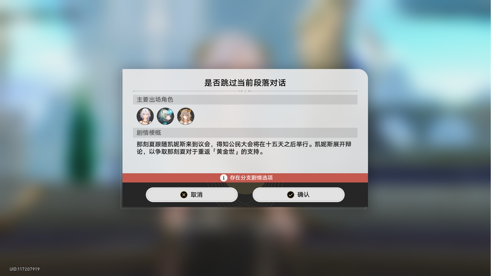
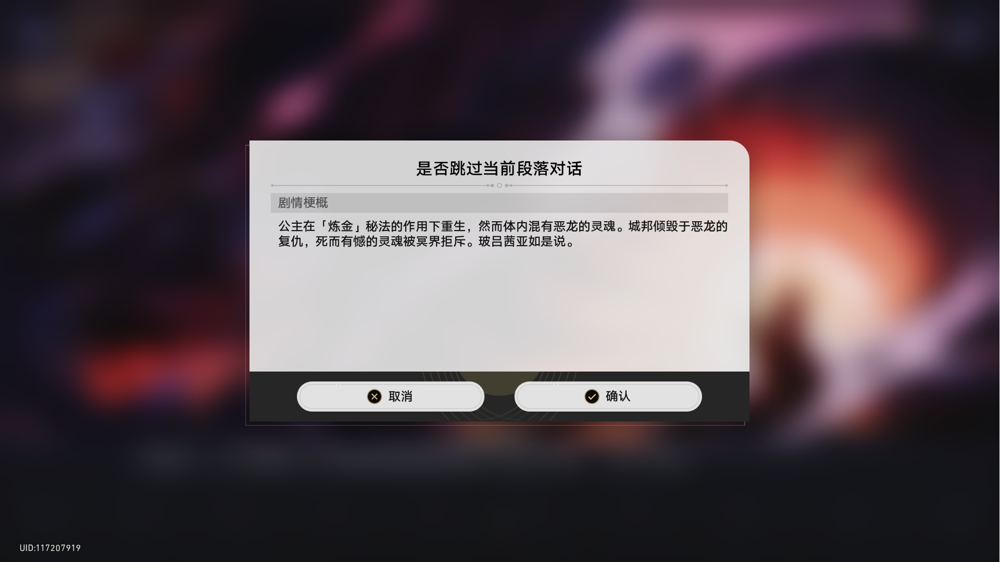
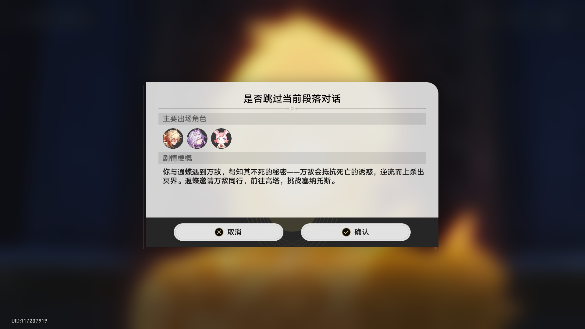

# Honkai: Star Rail Plot Summary Extractor

## Project Introduction
This is a tool that uses OCR technology to extract plot summary text from Honkai: Star Rail game screenshots. It automatically recognizes text in images and extracts content starting from "剧情梗概" (Plot Summary) until it encounters specific stop markers (such as "存在分支剧情选项" (Branching plot options exist), "取消" (Cancel), etc.).

## Features
- Automatically recognizes text in game screenshots
- Intelligently extracts plot summary content
- Supports custom start and stop markers
- Can output OCR debug information for optimizing recognition results
- Supports font enhancement to improve recognition accuracy
- Multi-language support: All prompt texts can be customized through language files for internationalization
- Supports multiple OCR APIs, with more OCR modules potentially being developed in the future
- Supports batch processing of multiple screenshots to save resource consumption
- Can download only one script file, which will automatically download other necessary files

## Installing Dependencies
1. Ensure Python 3.6 or higher is installed
2. Install necessary Python libraries:
   ```bash
   pip install Pillow chardet 
   ```
3. Different OCR APIs require different libraries, and the program will automatically prompt for required libraries
4. (Optional) Install game fonts to improve recognition accuracy. Note that only the font filenames "zh-cn.ttf", "zh-tw.ttf", and "ja-jp.ttf" are currently accepted, corresponding to the three fonts in Honkai: Star Rail's local game resources

## Usage
1. Download the script file `一键下崽.py` (One-click Download) from the release to the directory where you store your game screenshots (you can rename it freely without affecting usage)
2. Register an account on the [Baidu AI Open Platform](https://ai.baidu.com/) and create an OCR application to obtain APP_ID, API_KEY, and SECRET_KEY
3. Run the script `一键下崽.py` to complete the basic files in the library. Restart to complete the full lib directory, then enter your OCR API keys in `Parent_directory_of_the_script/lib/ocr_modules/selected_OCR_module/config.txt`
4. Run the script `一键下崽.py` again to start recognizing screenshots
5. Extracted results will be saved to a text file named after the current directory (for example, if run in the `.../example` directory, it will be saved as `.../example.txt`)
6. If you want to use other modules (such as test_module), you need to modify the OCR_MODULE configuration item in the configuration file, which is located in the `directory_where_the_script_is located`

## Multi-language Support
This project supports multi-language display, with all prompt texts loaded from language files for easy internationalization adaptation.

### Language File Structure
Language files are located in the `Parent_directory_of_the_script/lib/lang` directory, in JSON format, with filenames in the format `{language-code}.json` (e.g., `zh-cn.json` for Simplified Chinese).

### Existing Language Entries
Currently supported language entries include:
- Font detection related prompts
- Configuration file related prompts
- Dependency library installation related prompts
- Error message prompts
- And many more

### Adding a New Language
1. Create a new language file in the `lib/lang` directory, with a filename in the format `{language-code}.json`
2. Copy the content of the `zh-cn.json` file to the new file
3. Translate all text values into the target language
4. Load the new language file in the code

### Customizing Language Texts
You can modify the text values in existing language files to meet specific needs.


## Example Showcase
### Input Images
The project supports batch processing of game screenshots. Here are example input images:

| Image 1 | Image 2 |
|---------|---------|
|  |  |
| Image 3 | Image 4 |
|---------|---------|
|  |  |

### Example Output Results
After processing, the extracted plot summary will be saved to a text file named after the current directory (for example, if run in the `example` directory, it will be saved as `example.txt`). Example content is as follows:

```
你再度觐见欧洛尼斯。欧洛尼斯认可你的资质，将力量寄托于你。但如今的你仅是一簇独立行走的记忆，生命在穿过天界的那一刻就已逝去，仅以浮黎的瞥视稳固形体。若要接过神权，你必须从死亡手中找回被夺走的未来，这便是「岁月」真正的试炼。
那刻夏跟随凯妮斯来到议会，得知公民大会将在十五天之后举行。凯妮斯展开辩论，以争取那刻夏对于重返「黄金世」的支持。
公主在「炼金」秘法的作用下重生，然而体内混有恶龙的灵魂。城邦倾毁于恶龙的复仇，死而有憾的灵魂被冥界拒斥。玻吕茜亚如是说。
你与遐蝶遇到万敌，得知其不死的秘密——万敌会抵抗死亡的诱惑，逆流而上杀出冥界。遐蝶邀请万敌同行，前往高塔，挑战塞纳托斯。

处理统计: 成功4张, 失败0张

提示：已检测到zh-cn.ttf字体文件，已启用简体中文识别增强。
```

### OCR Debug Information
Setting `OUTPUT_OCR_DEBUG=true` in the configuration file can generate detailed OCR debug information to a debug file named after the current directory (for example, if run in the `example` directory, it will be saved as `example_ocr_debug.txt`), including recognition results, character block details, and processing status for each image. Example is as follows:

```
=== OCR调试信息 ===
处理时间: 2025-08-16 22:28:26
处理图片总数: 4
成功处理: 4张
失败处理: 0张
使用字体增强: 是
字体路径: /path/to/project/zh-cn.ttf

=== 图片 1.png OCR识别结果 ===
识别模式: 高精度
识别类型: CHN_ENG
原始识别结果: {'paragraphs_result': [{'words_result_idx': [0]}, {'words_result_idx': [1]}, {'words_result_idx': [2]}, ...], 'words_result': [{'probability': {'average': 0.9999536276, 'min': 0.9998266101, 'variance': 2.465130322e-09}, 'words': '是否跳过当前段落对话'}, ...]}
字块详情:
  字块 1: 内容="是否跳过当前段落对话", 置信度=0.9999536276
  处理: 跳过
  字块 2: 内容="主要出场角色", 置信度=0.9998242259
  处理: 跳过
  字块 3: 内容="剧情梗概", 置信度=0.9988465905
  处理: 开始记录点
  字块 4: 内容="你再度觐见欧洛尼斯。欧洛尼斯认可你的资质，将力量寄托于你。但如今的你仅是", 置信度=0.9997444153
  处理: 保留
  字块 5: 内容="一簇独立行走的记忆，生命在穿过天界的那一刻就已逝去，仅以浮黎的瞥视稳固形", 置信度=0.9998212457
  处理: 保留
  字块 6: 内容="体。若要接过神权，你必须从死亡手中找回被夺走的未来，这便是「岁月」真正的", 置信度=0.9998027086
  处理: 保留
  字块 7: 内容="试炼。", 置信度=0.9994756579
  处理: 保留
  字块 8: 内容="×", 置信度=0.9808494449
  处理: 停止记录点
  字块 9: 内容="取消", 置信度=0.999748826
  处理: 跳过
  字块 10: 内容="确认", 置信度=0.9997832775
  处理: 跳过
  字块 11: 内容="UID:117207919", 置信度=0.99916327
  处理: 跳过

=== 图片 2.png OCR识别结果 ===
识别模式: 高精度
识别类型: CHN_ENG
原始识别结果: （略）
字块详情:
  字块 1: 内容="是否跳过当前段落对话", 置信度=0.9999477267
  处理: 跳过
  字块 2: 内容="主要出场角色", 置信度=0.9998199344
  处理: 跳过
  字块 3: 内容="剧情梗概", 置信度=0.9989771843
  处理: 开始记录点
  字块 4: 内容="那刻夏跟随凯妮斯来到议会，得知公民大会将在十五天之后举行。凯妮斯展开辩", 置信度=0.9998417497
  处理: 保留
  字块 5: 内容="论，以争取那刻夏对于重返「黄金世」的支持。", 置信度=0.9998950958
  处理: 保留
  字块 6: 内容="i", 置信度=0.9657149911
  处理: 停止记录点
[The OCR recognition results for the follow-up and images 3.png and 4.png are omitted]
```
## Code Structure
The project adopts a modular design with a clear code structure, making it easy to maintain and extend.

### Directory Structure
```
├── .gitignore            # Git ignore file
├── LICENSE               # License file
├── README.md             # Project description document
├── example/              # Example directory containing sample images and processing scripts
│   ├── 1.png             # Sample image 1
│   ├── 2.png             # Sample image 2
│   ├── 3.png             # Sample image 3
│   ├── 4.png             # Sample image 4
│   ├── process_images.py # Main processing script
│   └── zh-cn.ttf         # Sample font file
└── lib/                  # Library directory containing various functional modules
    ├── __init__.py       # Package initialization file
    ├── bootstrap.py      # Bootstrapper module
    ├── config/           # Configuration management directory
    │   ├── __init__.py   # Configuration package initialization
    │   ├── config_ensure.py # Configuration ensure module
    │   ├── config_generator.py # Configuration generator
    │   ├── config_loader.py # Configuration loader
    │   ├── config_manager.py # Configuration manager
    │   └── default_config.py # Default configuration definition
    ├── dependency_check.py # Dependency library check module
    ├── lang/             # Language files directory
    │   ├── en.json       # English language file
    │   └── zh-cn.json    # Simplified Chinese language file
    ├── lang_manager.py   # Language manager
    ├── ocr_core/         # OCR core module
    │   ├── __init__.py   # OCR core package initialization
    │   ├── ocr_module.py # OCR module base class
    │   ├── ocr_module_interface.py # OCR module interface
    │   └── ocr_module_bootstraper.py # OCR module bootstraper
    ├── ocr_modules/      # OCR modules directory
    │   ├── baidu/        # Baidu OCR module directory (detailed structure defined in module)
    │   └── test_module/  # Debug OCR module directory (detailed structure defined in module)
    ├── supported_fonts.json # Supported fonts list
    ├── text_extracting/  # Text extraction module
    │   ├── __init__.py   # Text extraction package initialization
    │   ├── font_enhancement_detector.py # Font enhancement detector
    │   └── text_extractor.py # Text extractor
    └── text_processor.py # Text processor
```

### Module Function Description
- `process_images.py`: Main processing script responsible for image processing flow control
- `lib/config/*`: Configuration file reading and parsing modules, including config ensure, config generator, config loader, config manager, and default config
- `lib/dependency_check.py`: Dependency library check module
- `lib/lang/*`: Language files directory containing translation texts for various languages
- `lib/lang_manager.py`: Language manager responsible for loading and retrieving language texts
- `lib/ocr_core/*`: OCR core module used to support different OCR APIs
- `lib/ocr_modules/*`: OCR modules directory containing implementations for different OCR engines, such as Baidu OCR
  - The detailed structure of each OCR module is defined by its internal `module_bootstrap.py` file
- `lib/supported_fonts.json`: List of supported fonts
- `lib/text_extracting/*`: Text extraction module containing font enhancement detection and text extraction functions
- `lib/text_processor.py`: Text processor responsible for processing extracted text
- `lib/bootstrap.py`: Bootstrapper module responsible for project initialization and directory structure management

## Configuration Description
The configuration file `example/config.txt` contains the following parameters:
- `OUTPUT_OCR_DEBUG`: Whether to output OCR debug information to a separate file (true/false)
- `START_MARKERS`: Start markers, start recording text when these text blocks are detected (multiple markers separated by commas)
- `STOP_MARKERS`: Stop markers, stop recording text when these text blocks are detected (multiple markers separated by commas)
- `OCR_MODULE`: OCR API selection (default baidu, optional test_module)
- `MAX_VERTICAL_IMAGES`: Maximum number of images for vertical stitching recognition (default 4)
- `OCR_LANGUAGE`: OCR recognition language (default zh-cn)

## Notes
1. You can place game font files (such as zh-cn.ttf) in the directory where you want to process images to improve recognition accuracy
2. OCR APIs generally have free usage limits, please use them reasonably

## Contribution
Welcome to submit Issues and Pull Requests to improve this tool.

## Future Plans
Now that font enhancement is enabled, is Baidu's OCR API still necessary? Or can we directly use locally deployed OCR services?
Next, I will try to directly use locally deployed OCR services to recognize text in images, thereby bypassing Baidu's service charges.

## License
This project adopts the MIT License.
